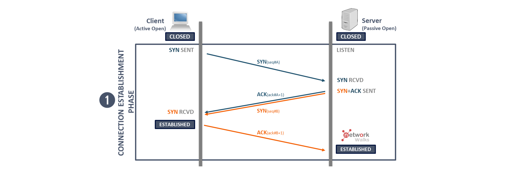

# Aim

### To analyze and Compare:

- A valid trusted Certificate

- An In-Valid / Self Signed Certificate

### Key Terms to understand
- Issuer
- Subject
- Validity
- Public Key
- Signature Algorithm
- Certificate Chain
- Trust Model

# Site used for analysis:

- https://www.wifrizzy.com/  
- https://www.ssllabs.com/ssltest/ 
- https://self-signed.badssl.com/ 

## Understanding TCP + SSL/TLS Handshake

TCP handshake is a 3 way handshake that ensures that a user and a client are forming a secure connection with each other, before data transmission takes place. 

Its 3 steps for a secure connection:

- **User to Server** -------> Syn Flag | User initiates a connection with the Server

- **Server to User** -------> Syn Ack Flag | Server acknowledges the connection request by sending its own sequence number

- **User to Server** -------> Ack Flag | User sends an ACK packet back to let it know for the connection it is ready to build and send data packet.

> This does not end here as secure connection requires a secure validity and assurance for the user that we are connecting to the right domain.
----------------

### SSL/TLS  mechanism for HTTPS working

**SSL** Secure Socket layer was for HTTP Protocol
**TLS** Transport Layer Security for HTTPS protocol

It is a encryption based protocol mechanism to secure the actual connecetion with the **internet**. They excahnge the message with each other to ensure the validity, the credibility of the security and the authenticity to share **Assymetric Secure Session Keys** trasnport layer of security which happens just after the TCP handhsake 

### Rough Steps and Working:

- Specify which version of TLS (TLS 1.0, 1.2, 1.3, etc.) they will use
- Decide on which cipher suites (see below) they will use
- Authenticate the identity of the server via the server’s public key and the SSL certificate authority’s digital signature
- Generate session keys in order to use symmetric encryption after the handshake is complete

> The version of TLS used today will always be **above 1.3** as 1.3 due to better **Algorithm**, **Faster Speed** and **Forward Secreacy**. 

### TLS Handshake Detail

Step-1: Client Hello
- TLS Version
- S-Nounce (Sender Random Message)
- Supporter Cipher Suits (Latest)

Step-2: Server Hello
- TLS Version Agreed
- ANounce (Authenticator Random Message)
- Selected Cipher Suits

Step-3: Certificate Exchange
- Server Public Key
- Domian name Info
- CA signature
- Validity of certificte

Step-4: Key Exchange
- TLS Handshake version 1.3 (DIFFE Hellman Eleptical Curve)

Step-5: Handshake Completion
- Session Key Generated with help of the ANounce and Snounce and PMK (Pairwise Master Key) is generated

## Part-1: Investigating a Valid Certifcate

Let us visit a legitmate website which will be the: 

**Site:**  https://www.wifrizzy.com/  

We first just over the surface view the security of the and safety of the site which ensures that the connection is secure. 

> This does not mean if the site is using a HTTPS protocol itselfbut it also means that other than a secure protocol does the site use a valid certificate. and why is a valid certificate important..is what I will answer below.

- We first click the lock symbol or the button next to the referesh sign

- Go to connection is secure and see the certification is valid.

- We click on certificate is valid and a new dynamic build in page for the Certifcate gets opened.

### Information to be Extracted

- **Subject** (Who is it issued to): 
    CN = wifrizzy.com

- **Issuer** (Which CA issued it): 

    CN (Subject) = wifrizzy.com
    O (Organization) = Let's Encrypt
    C (Country) = US

- **Valid from and to**:

    Issued On:	Wednesday, 17 December 2025 at 07:16:54
    
    Expires On:	Tuesday, 17 March 2026 at 07:16:53

- **Signature Algorithm**: 

    PKCS #1 SHA-256 With RSA Encryption 

    

- **Public Key Size (2048-bit, 4096-bit):** 
    
    2048-bit

    

- **Certificate Subject Alternative Name:**
    
    Not Critical
    
    DNS Name: wifrizzy.com
    
    DNS Name: www.wifrizzy.com
    
    

- **SHA-256: Public FIngerprint:**
    
    - **Certificate:** 8c52909cb38d657766cc4acdc16addf040c7a90a637a72789580bb81e49c94b2
    - **Public key:**	585c5ee3887801e2bcfda537d4138bc5c02df5ee97461e0f6fcf05293269d83d
    
    

## Why is validted and Certified certificate from a CA important?

> Despite a user  securing its connection with a website using the HTTPS protocol, it only ensures the encrypted connection of user and server, while it encrypts the data sent between each other. The real safety of a connection with a user based on the server's identity is guarnteed by the CA. 

- A CA's Role is to verify that the applicant own's the domian and operate it.
- Without a CA a MITM (Man In The Middle Attack is still possible)
- This builds a chain of trust as each site come with a root certificate.
- If ever the certificate's private key is stolen, then certificate must be considered as invalid immediately  
- These certificate are the SSL/TLS (Secure Socket Layer/ Transport Layer Security) which are a part of Assymetric Cryptography, also known as the **PKI: Public Key Infrastructure System** 

> **Assymmetric Cryptography** uses two set of keys, public key which is open for the public and well known to both the  user and the server, and the Private Key is only known to the user/owner and not to anyone else.  

**"*Anything encrypted with the public key can only be decrypted by the private key and vice-versa.*"**

- A normal web user will be using the public key to decrypt the web page that is secured with the private key to access out information.

 When you request a HTTPS connection to a webpage, the website will initially send its SSL certificate to your browser. This certificate contains the public key needed to begin the secure session. Based on this initial exchange, your browser and the website then initiate the 'SSL handshake'. The SSL handshake involves the generation of shared secrets to establish a uniquely secure connection between yourself and the website.

When a trusted SSL Digital Certificate is used during a HTTPS connection, users will see a padlock icon in the browser address bar. When an Extended Validation Certificate is installed on a web site, the address bar will turn green. 

## Part-2: Online SSL Deep Analysis Tool

We will now verify the credibility of certificate and gain the score of how the domain is actually ranked in terms of server security and identity.

This gives:

- TLS version support

- Weak cipher detection

- Certificate chain validation

- Expiry warnings

- Overall grade (A+, A, B, etc.)

Verified Score of the website is:

## Part 3: Investigation of a Non-Trusted Certificate

Now Lets compare this to a non trusted site with a un-secure TLS/SSL Certificate

**Site**: https://self-signed.badssl.com/

> Note: This site intentionally uses a own certificate

We are able to notice the following readings from the site:

- Broswer Warning

- Organization and the Issuer are the same hence poor readings.

- Trust Score of Website

- Certification Path

# Blue Team Perspective

From an angle of blue team we can keep certain kind of alerts generation specially if users are visiting un trusted website: 

- Certification expired. 
- Rouge Internal Certificates
- Fake Certificates used in Phishing

## Point to Be Noted

It is important to know and to be aware despite a HTTPS secure Protcol, a valid CA certificate. MITM is still possible and it can still exploit users who are going to be using a website they visit. 

### Reasons:

- Malacious CA
- SSL Stripping (Downgrading Attack)
- Installing Root CA in local machine via Malware
- Ignoring warning and still going to access site
- Proxy Monitoring

# Conclusion

This shows us the importance of SSL/TLS certificate and how it is important to know and be aware of the sites we are using. We should't go and always cross verify with tools if we are using a legitmate site, but sometimes having teams like SOC and certain policy wihin organization can really make the difference. It is a matter of knowledge and the matter of how we should be aware as a user. 

# Resources

- https://web.archive.org/web/20161213142308/https://www.instantssl.com/ssl-certificate-products/https.html 
- https://www.serverion.com/uncategorized/ssl-tls-handshake-process-step-by-step-guide/
- https://www.cloudflare.com/en-gb/learning/ssl/what-happens-in-a-tls-handshake/

- https://www.manageengine.com/key-manager/information-center/what-is-ssl-tls-handshake.html 
